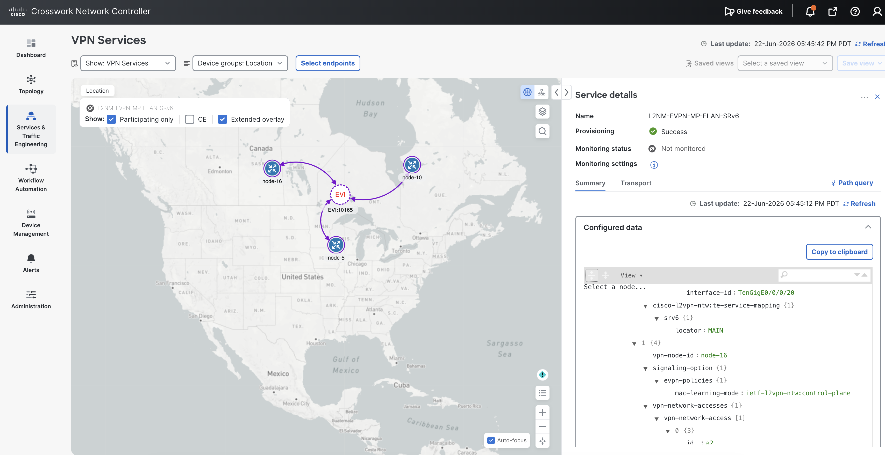
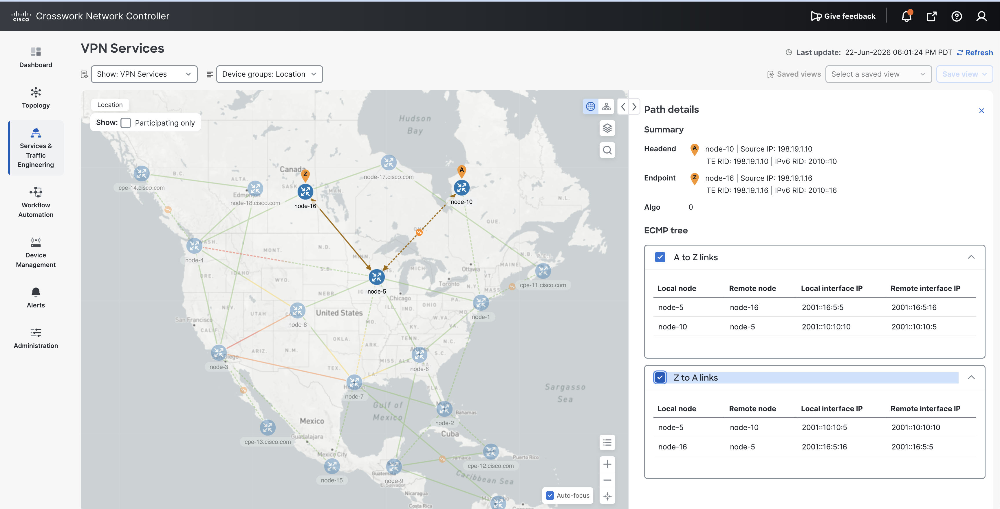

# TSDN CNC 7.2: EVPN-MP E-LAN over SRv6 Locator Fix

Device-template update for Cisco Crosswork Network Controller TSDN Function Pack 7.2 to render the SRv6 locator under EVPN Multipoint E-LAN services.

## Overview

For EVPN Multipoint (E-LAN) services, the TSDN Function Pack package `cisco-L2vpn-fp-internal` did not render the SRv6 binding and per-EVI locator under the top-level IOS-XR `evpn evi <id>` configuration block.

The SRv6 locator was provided in the service payload at:

```text
cisco-l2vpn-ntw:te-service-mapping/srv6/locator
```

However, for EVPN-MP services, the generated device configuration silently dropped the locator.

This update adds the missing IOS-XR CLI NED leaves so the following configuration is rendered correctly:

```ios
evpn
 evi 10165
  segment-routing srv6
  advertise-mac
  locator MAIN
```

## Environment

| Item | Value |
| --- | --- |
| Product | Cisco Crosswork Network Controller (CNC), TSDN Function Pack 7.2 |
| Function Pack package | `cisco-L2vpn-fp-internal` |
| Reference source | `tsdn-7.2.0-source-code-nso-6.4.8.a83516ab` |
| SVM eNSO package example | `ncs-6.4.11-cisco-L2vpn-fp-internal-7.2.1.tar.gz` |
| Service type | L2NM EVPN Multipoint (E-LAN) |
| Topology | `any-to-any` |
| Transport | SRv6 |
| External reference | [SRv6 Transport on NCS5500, Part 6: EVPN ELAN over SRv6](https://xrdocs.io/ncs5500/tutorials/srv6-transport-on-ncs-part-6/) |

## What Changed

Update this template: 

```text
packages/cisco-L2vpn-fp-internal/templates/cisco-flat-L2vpn-fp-cli-evpn-multipoint-template.xml
```

Under `evpn / evi`, add:

| XML leaf | IOS-XR CLI rendered |
| --- | --- |
| `<segment-routing when="{srv6}">srv6</segment-routing>` | `segment-routing srv6` |
| `<locator when="{srv6/locator!=''}">{srv6/locator}</locator>` | `locator <LOCATOR>` |

Important: in the IOS-XR CLI NED structure, `locator` is a sibling leaf under `<evi>`. It is not nested inside `<segment-routing>`.

## Template Patch
Refer the updated package: cisco-L2vpn-fp-internal in this git repo.

Add the `segment-routing` and `locator` leaves in the EVPN-MP device template:

```xml
<evpn xmlns="http://tail-f.com/ned/cisco-ios-xr">
  <evi>
    <id>{$EVI_ID}</id>
    <segment-routing when="{srv6}">srv6</segment-routing>

    <bgp>
      ...
    </bgp>

    <etree when="...">...</etree>

    <advertise-mac when="{advertise-mac/enable = 'true'}">
    </advertise-mac>

    <control-word-disable when="{control-word-disable = 'true'}">
    </control-word-disable>

    <locator when="{srv6/locator!=''}">{srv6/locator}</locator>
  </evi>
</evpn>
```

## Deployment Notes

The example below shows the fix applied to a running SVM eNSO package copy. The same template change can be applied to a CNC cluster setup using the corresponding package location and package reload flow.

1. Log in to Crosswork and enter the eNSO pod.

2. Go to the NSO package directory:

   ```console
   cd /nso/run/packages
   ls -ltr | grep L2
   ```

   Example package:

   ```console
   -rw------- 1 root root 170582 Mar 19 21:10 ncs-6.4.11-cisco-L2vpn-fp-internal-7.2.1.tar.gz
   ```

3. Back up the package archive outside `/nso/run/packages`.

   ```console
   mkdir -p /tmp/tsdn-l2vpn-backup
   cp ncs-6.4.11-cisco-L2vpn-fp-internal-7.2.1.tar.gz /tmp/tsdn-l2vpn-backup/ncs-6.4.11-cisco-L2vpn-fp-internal-7.2.1.tar.gz.backup
   ```

4. Extract the package and move the archive out of the active package directory.

   ```console
   tar -zxvf ncs-6.4.11-cisco-L2vpn-fp-internal-7.2.1.tar.gz
   mv ncs-6.4.11-cisco-L2vpn-fp-internal-7.2.1.tar.gz /tmp/tsdn-l2vpn-backup/
   ```

5. Edit the EVPN-MP template:

   ```text
   /nso/run/packages/cisco-L2vpn-fp-internal/templates/cisco-flat-L2vpn-fp-cli-evpn-multipoint-template.xml
   ```

6. Reload NSO packages:

   ```console
   echo "packages reload" | ncs_cli -u admin -C
   ```

   Expected result:

   ```text
   result true
   cisco-L2vpn-fp-internal oper-status up
   ```

## Service Payload Example

Example L2NM EVPN-MP E-LAN service:

| Field | Value |
| --- | --- |
| VPN ID | `L2NM-EVPN-MP-ELAN-SRv6` |
| EVI | `10165` |
| Bridge group | `BRIDGE` |
| SRv6 locator | `MAIN` |
| PE nodes | `node-10`, `node-16`, `node-5` |

<details>
<summary>Show JSON payload</summary>

```json
{
  "ietf-l2vpn-ntw:l2vpn-ntw": {
    "vpn-services": {
      "vpn-service": [
        {
          "vpn-id": "L2NM-EVPN-MP-ELAN-SRv6",
          "vpn-type": "ietf-vpn-common:mpls-evpn",
          "vpn-service-topology": "ietf-vpn-common:any-to-any",
          "vpn-nodes": {
            "vpn-node": [
              {
                "vpn-node-id": "node-10",
                "signaling-option": {
                  "evpn-policies": {
                    "mac-learning-mode": "ietf-l2vpn-ntw:control-plane"
                  }
                },
                "vpn-network-accesses": {
                  "vpn-network-access": [
                    {
                      "id": "a3",
                      "interface-id": "TenGigE0/0/0/20",
                      "connection": {
                        "encapsulation": {
                          "encap-type": "ietf-vpn-common:dot1q",
                          "dot1q": {
                            "cvlan-id": 3111,
                            "tag-operations": {
                              "pop": "1",
                              "cisco-l2vpn-ntw:mode": "symmetric"
                            }
                          }
                        }
                      }
                    }
                  ]
                },
                "cisco-l2vpn-ntw:te-service-mapping": {
                  "srv6": {
                    "locator": "MAIN"
                  }
                }
              },
              {
                "vpn-node-id": "node-16",
                "signaling-option": {
                  "evpn-policies": {
                    "mac-learning-mode": "ietf-l2vpn-ntw:control-plane"
                  }
                },
                "vpn-network-accesses": {
                  "vpn-network-access": [
                    {
                      "id": "a2",
                      "interface-id": "TenGigE0/0/0/30",
                      "connection": {
                        "encapsulation": {
                          "encap-type": "ietf-vpn-common:dot1q",
                          "dot1q": {
                            "cvlan-id": 3111,
                            "tag-operations": {
                              "pop": "1",
                              "cisco-l2vpn-ntw:mode": "symmetric"
                            }
                          }
                        }
                      }
                    }
                  ]
                },
                "cisco-l2vpn-ntw:te-service-mapping": {
                  "srv6": {
                    "locator": "MAIN"
                  }
                }
              },
              {
                "vpn-node-id": "node-5",
                "signaling-option": {
                  "evpn-policies": {
                    "mac-learning-mode": "ietf-l2vpn-ntw:control-plane"
                  }
                },
                "vpn-network-accesses": {
                  "vpn-network-access": [
                    {
                      "id": "a4",
                      "interface-id": "HundredGigE0/0/0/30",
                      "connection": {
                        "encapsulation": {
                          "encap-type": "ietf-vpn-common:dot1q",
                          "dot1q": {
                            "cvlan-id": 3110,
                            "tag-operations": {
                              "pop": "1",
                              "cisco-l2vpn-ntw:mode": "symmetric"
                            }
                          }
                        }
                      }
                    }
                  ]
                },
                "cisco-l2vpn-ntw:te-service-mapping": {
                  "srv6": {
                    "locator": "MAIN"
                  }
                }
              }
            ]
          },
          "cisco-l2vpn-ntw:evi-id": 10165,
          "cisco-l2vpn-ntw:bridge-group": "BRIDGE"
        }
      ]
    }
  }
}
```
</details>

## CNC TSDN NSO Dry Run Config Pushed to Network

The NSO dry-run output below shows the device configuration generated for the EVPN-MP E-LAN service before it is pushed to the network. The important SRv6 evidence is present on all three PE nodes: `evi 10165 segment-routing srv6` and `locator MAIN`.

<details>
<summary>Show NSO dry-run CLI config</summary>

```text
admin@ncs(config)# l2vpn-ntw vpn-services vpn-service L2NM-EVPN-MP-ELAN-SRv6 get-modifications outformat cli-c
cli-c {
    local-node {
        data devices device node-10
               config
                interface TenGigE 0/0/0/20
                 description T-SDN Interface
                 no shutdown
                exit
                interface TenGigE 0/0/0/20.3111 l2transport
                 description T-SDN Interface
                 encapsulation dot1q 3111
                 no shutdown
                 rewrite ingress tag pop 1 symmetric
                exit
                evpn
                 evi 10165 segment-routing srv6
                  bgp
                  exit
                  advertise-mac
                   !
                  locator MAIN
                 exit
                exit
                l2vpn
                 bridge group BRIDGE
                  bridge-domain BRIDGE_evi_10165
                   interface TenGigE0/0/0/20.3111
                   exit
                   evi 10165 segment-routing srv6
                   exit
                  exit
                 exit
                exit
               !
              !
              devices device node-16
               config
                interface TenGigE 0/0/0/30
                 description T-SDN Interface
                 no shutdown
                exit
                interface TenGigE 0/0/0/30.3111 l2transport
                 description T-SDN Interface
                 encapsulation dot1q 3111
                 no shutdown
                 rewrite ingress tag pop 1 symmetric
                exit
                evpn
                 evi 10165 segment-routing srv6
                  bgp
                  exit
                  advertise-mac
                   !
                  locator MAIN
                 exit
                exit
                l2vpn
                 bridge group BRIDGE
                  bridge-domain BRIDGE_evi_10165
                   interface TenGigE0/0/0/30.3111
                   exit
                   evi 10165 segment-routing srv6
                   exit
                  exit
                 exit
                exit
               !
              !
              devices device node-5
               config
                interface HundredGigE 0/0/0/30
                 description T-SDN Interface
                 no shutdown
                exit
                interface HundredGigE 0/0/0/30.3110 l2transport
                 description T-SDN Interface
                 encapsulation dot1q 3110
                 no shutdown
                 rewrite ingress tag pop 1 symmetric
                exit
                evpn
                 evi 10165 segment-routing srv6
                  bgp
                  exit
                  advertise-mac
                   !
                  locator MAIN
                 exit
                exit
                l2vpn
                 bridge group BRIDGE
                  bridge-domain BRIDGE_evi_10165
                   interface HundredGigE0/0/0/30.3110
                   exit
                   evi 10165 segment-routing srv6
                   exit
                  exit
                 exit
               exit
               !
              !

    }
}
```

</details>

## CNC Verification (nodes node-10, node-16, node-5)

The fix was verified on `node-10`, `node-16`, and `node-5`.

### CNC service view

The CNC service details view shows the EVPN-MP E-LAN service provisioned successfully, with EVI `10165` and SRv6 locator `MAIN` visible in the configured service data.



### CNC path view

The CNC path details view shows the computed ECMP path between the participating PEs for the same service.



### Device CLI checks

| Check | Expected evidence |
| --- | --- |
| `show evpn evi vpn-id 10165 detail` | EVI uses `Encap SRv6` and shows `SRv6 Locator Name: MAIN` |
| `show segment-routing srv6 sid` | EVPN `uDT2U` and `uDT2M` SIDs are allocated from locator `MAIN` |
| `show l2vpn bridge-domain bd-name BRIDGE_evi_10165` | Bridge domain is `state: up` and EVPN is `state: up` |

<details>
<summary>show evpn evi vpn-id 10165 detail</summary>

### Node-10

```text
VPN-ID     Encap      Bridge Domain                Type
---------- ---------- ---------------------------- -------------------
10165      SRv6       BRIDGE_evi_10165             EVPN
   Stitching: Regular
   Unicast SID:  fcbb:0:10:e006::
   Multicast SID:  fcbb:0:10:e007::
   E-Tree: Root
   Forward-class: 0
   Advertise MACs: Yes
   Advertise BVI MACs: No
   Aliasing: Enabled
   UUF: Enabled
   Re-origination: Enabled
   Multicast:
     IGMP-Snooping Proxy: No
     MLD-Snooping Proxy : No
   BGP Implicit Import: Enabled
   VRF Name:
   SRv6 Locator Name: MAIN
   SRv6 SID Function Length: 16 bits
   Preferred Nexthop Mode: Off
   BVI Coupled Mode: No
   BVI Subnet Withheld: ipv4 No, ipv6 No
   L3VRF Label Mode: Per-VRF
   RD Config: none
   RD Auto  : (auto) 198.19.1.10:10165
   RT Auto  : 65000:10165
   Route Targets in Use           Type
   ------------------------------ ---------------------
   65000:10165                    Import
   65000:10165                    Export
```

### Node-16

```text
VPN-ID     Encap      Bridge Domain                Type
---------- ---------- ---------------------------- -------------------
10165      SRv6       BRIDGE_evi_10165             EVPN
   Stitching: Regular
   Unicast SID:  fcbb:0:16:e007::
   Multicast SID:  fcbb:0:16:e008::
   E-Tree: Root
   Forward-class: 0
   Advertise MACs: Yes
   Advertise BVI MACs: No
   Aliasing: Enabled
   UUF: Enabled
   Re-origination: Enabled
   Multicast:
     IGMP-Snooping Proxy: No
     MLD-Snooping Proxy : No
   BGP Implicit Import: Enabled
   VRF Name:
   SRv6 Locator Name: MAIN
   SRv6 SID Function Length: 16 bits
   Preferred Nexthop Mode: Off
   BVI Coupled Mode: No
   BVI Subnet Withheld: ipv4 No, ipv6 No
   L3VRF Label Mode: Per-VRF
   RD Config: none
   RD Auto  : (auto) 198.19.1.16:10165
   RT Auto  : 65000:10165
   Route Targets in Use           Type
   ------------------------------ ---------------------
   65000:10165                    Import
   65000:10165                    Export
```

### Node-5

```text
VPN-ID     Encap      Bridge Domain                Type
---------- ---------- ---------------------------- -------------------
10165      SRv6       BRIDGE_evi_10165             EVPN
   Stitching: Regular
   Unicast SID:  fcbb:0:5:e00b::
   Multicast SID:  fcbb:0:5:e00c::
   E-Tree: Root
   Forward-class: 0
   Advertise MACs: Yes
   Advertise BVI MACs: No
   Aliasing: Enabled
   UUF: Enabled
   Re-origination: Enabled
   Multicast:
     IGMP-Snooping Proxy: No
     MLD-Snooping Proxy : No
   BGP Implicit Import: Enabled
   VRF Name:
   SRv6 Locator Name: MAIN
   SRv6 SID Function Length: 16 bits
   Preferred Nexthop Mode: Off
   BVI Coupled Mode: No
   BVI Subnet Withheld: ipv4 No, ipv6 No
   RD Config: none
   RD Auto  : (auto) 198.19.1.5:10165
   RT Auto  : 65000:10165
   Route Targets in Use           Type
   ------------------------------ ---------------------
   65000:10165                    Import
   65000:10165                    Export
```

</details>

<details>
<summary>show segment-routing srv6 sid</summary>

All three PEs allocate both EVPN SIDs from the `MAIN` locator block, with owner `l2vpn_srv6`, context `10165:0`, and state `InUse`.

### Node-10

```text
*** Locator: 'MAIN' ***

fcbb:0:10::                 uN (PSP/USD)      'default':16                      sidmgr              InUse  Y
fcbb:0:10:e000::            uDT2U             12346:0                           l2vpn_srv6          InUse  Y
fcbb:0:10:e001::            uDT2M             12346:0                           l2vpn_srv6          InUse  Y
fcbb:0:10:e002::            uA (PSP/USD)      [BE101, Link-Local]:0             isis-1              InUse  Y
fcbb:0:10:e003::            uA (PSP/USD)      [BE105, Link-Local]:0             isis-1              InUse  Y
fcbb:0:10:e004::            uB6 (PSP/USD Insert.Red)  'srte_c_2112_ep_2010::5' (2112, 2010::5)  xtc_srv6            InUse  Y
fcbb:0:10:e005::            uB6 (PSP/USD Insert.Red)  'srte_c_2112_ep_2010::16' (2112, 2010::16)  xtc_srv6            InUse  Y
fcbb:0:10:e006::            uDT2U             10165:0                           l2vpn_srv6          InUse  Y
fcbb:0:10:e007::            uDT2M             10165:0                           l2vpn_srv6          InUse  Y
```

### Node-16

```text
*** Locator: 'MAIN' ***

fcbb:0:16::                 uN (PSP/USD)      'default':22                      sidmgr              InUse  Y
fcbb:0:16:e000::            uDT2U             12346:0                           l2vpn_srv6          InUse  Y
fcbb:0:16:e001::            uDT2M             12346:0                           l2vpn_srv6          InUse  Y
fcbb:0:16:e002::            uA (PSP/USD)      [Hu0/0/0/37, Link-Local]:0        isis-1              InUse  Y
fcbb:0:16:e003::            uA (PSP/USD)      [Te0/0/0/4, Link-Local]:0         isis-1              InUse  Y
fcbb:0:16:e004::            uA (PSP/USD)      [Te0/0/0/5, Link-Local]:0         isis-1              InUse  Y
fcbb:0:16:e005::            uB6 (Insert.Red)  'srte_c_2112_ep_2010::5' (2112, 2010::5)  xtc_srv6            InUse  Y
fcbb:0:16:e006::            uB6 (Insert.Red)  'srte_c_2112_ep_2010::10' (2112, 2010::10)  xtc_srv6            InUse  Y
fcbb:0:16:e007::            uDT2U             10165:0                           l2vpn_srv6          InUse  Y
fcbb:0:16:e008::            uDT2M             10165:0                           l2vpn_srv6          InUse  Y
```

### Node-5

```text
*** Locator: 'MAIN' ***

fcbb:0:5::                  uN (PSP/USD)      'default':5                       sidmgr              InUse  Y
fcbb:0:5:e000::             uDT2U             12346:0                           l2vpn_srv6          InUse  Y
fcbb:0:5:e001::             uDT2M             12346:0                           l2vpn_srv6          InUse  Y
fcbb:0:5:e002::             uA (PSP/USD)      [Hu0/0/0/18, Link-Local]:0        isis-1              InUse  Y
fcbb:0:5:e003::             uA (PSP/USD)      [Hu0/0/0/16, Link-Local]:0        isis-1              InUse  Y
fcbb:0:5:e004::             uA (PSP/USD)      [Hu0/0/0/14, Link-Local]:0        isis-1              InUse  Y
fcbb:0:5:e005::             uA (PSP/USD)      [BE45, Link-Local]:0              isis-1              InUse  Y
fcbb:0:5:e006::             uA (PSP/USD)      [BE57, Link-Local]:0              isis-1              InUse  Y
fcbb:0:5:e007::             uA (PSP/USD)      [BE105, Link-Local]:0             isis-1              InUse  Y
fcbb:0:5:e008::             uB6 (Insert.Red)  'srte_c_2112_ep_2010::10' (2112, 2010::10)  xtc_srv6            InUse  Y
fcbb:0:5:e009::             uA (PSP/USD)      [Hu0/0/0/8, Link-Local]:0         isis-1              InUse  Y
fcbb:0:5:e00a::             uB6 (Insert.Red)  'srte_c_2112_ep_2010::16' (2112, 2010::16)  xtc_srv6            InUse  Y
fcbb:0:5:e00b::             uDT2U             10165:0                           l2vpn_srv6          InUse  Y
fcbb:0:5:e00c::             uDT2M             10165:0                           l2vpn_srv6          InUse  Y
```

</details>

<details>
<summary>show l2vpn bridge-domain bd-name BRIDGE_evi_10165</summary>

All three PEs show bridge-domain `state: up` and EVPN `state: up`.

### Node-10

```text
Tue Jun 23 00:55:34.832 UTC
Legend: pp = Partially Programmed.
Bridge group: BRIDGE, bridge-domain: BRIDGE_evi_10165, id: 1, state: up, ShgId: 0, MSTi: 0
  Aging: 300 s, MAC limit: 64000, Action: none, Notification: syslog
  Filter MAC addresses: 0
  ACs: 1 (1 up), VFIs: 0, PWs: 0 (0 up), PBBs: 0 (0 up), VNIs: 0 (0 up)
  List of EVPNs:
    EVPN, state: up
  List of ACs:
    Te0/0/0/20.3111, state: up, Static MAC addresses: 0, MSTi: 2
  List of Access PWs:
  List of VFIs:
  List of Access VFIs:
```

### Node-16

```text
Tue Jun 23 00:55:36.471 UTC
Legend: pp = Partially Programmed.
Bridge group: BRIDGE, bridge-domain: BRIDGE_evi_10165, id: 1, state: up, ShgId: 0, MSTi: 0
  Aging: 300 s, MAC limit: 4000, Action: none, Notification: syslog
  Filter MAC addresses: 0
  ACs: 1 (1 up), VFIs: 0, PWs: 0 (0 up), PBBs: 0 (0 up), VNIs: 0 (0 up)
  List of EVPNs:
    EVPN, state: up
  List of ACs:
    Te0/0/0/30.3111, state: up, Static MAC addresses: 0, MSTi: 2
  List of Access PWs:
  List of VFIs:
  List of Access VFIs:
```

### Node-5

```text
Tue Jun 23 00:55:38.028 UTC
Legend: pp = Partially Programmed.
Bridge group: BRIDGE, bridge-domain: BRIDGE_evi_10165, id: 1, state: up, ShgId: 0, MSTi: 0
  Aging: 300 s, MAC limit: 64000, Action: none, Notification: syslog
  Filter MAC addresses: 0
  ACs: 1 (1 up), VFIs: 0, PWs: 0 (0 up), PBBs: 0 (0 up), VNIs: 0 (0 up)
  List of EVPNs:
    EVPN, state: up
  List of ACs:
    Hu0/0/0/30.3110, state: up, Static MAC addresses: 0, MSTi: 2
  List of Access PWs:
  List of VFIs:
  List of Access VFIs:
```

</details>

## Scope

This fix applies to the IOS-XR CLI NED path used by these nodes:

```text
cisco-flat-L2vpn-fp-cli-evpn-multipoint-template.xml
```

It specifically closes the EVPN-MP E-LAN SRv6 locator rendering gap by ensuring the per-EVI `locator <LOCATOR>` is emitted when `srv6/locator` is present in the service payload.
